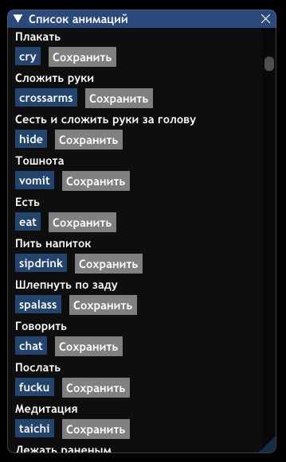
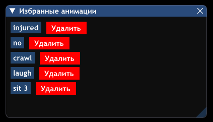

# GambitAnimList

Скрипт для удобного доступа к анимациям на сервере Gambit RP в игре GTA San Andreas Multiplayer (SAMP).

## Описание

Lua-скрипт, который предоставляет удобный интерфейс для поиска и использования анимаций на сервере Gambit Role Play. Скрипт включает в себя:

- Полный список анимаций сервера с их серверными названиями
- Поисковую систему для быстрого нахождения нужной анимации
- Возможность сохранения анимаций в избранное
- Автоматическое сохранение избранных анимаций для последующего использования

## Особенности

- 🔍 **Умный поиск**: Поиск не только по названиям анимаций, но и с учетом описания, ключевых слов
- ⭐ **Избранное**: Возможность сохранения часто используемых анимаций в отдельную панель
- 🎮 **Горячие клавиши**: Быстрый доступ к меню через комбинации клавиш

## Установка

1. Скачать файл `anims.lua`
2. Поместить файл в папку `moonloader` в директории игры

## Использование

- `ALT + 8` - основное меню со списком анимаций и поиском
- `ALT + 9` - список избранных анимаций

## Важно

- Не удаляйте файл `favorites.txt`, который создается рядом со скриптом - в нем хранятся ваши избранные анимации
- Для работы скрипта требуется [moonloader](https://blast.hk/moonloader) и [mimgui](https://blast.hk/threads/19292/)

## Планы на будущее

- Ручная корректировка и оптимизация ключевых слов для улучшения поиска
- Добавление новых анимаций при их появлении на сервере
- Улучшение пользовательского интерфейса

## Благодарности

Особая благодарность [CHAPO](https://www.blast.hk/members/112329/) за код-ревью.